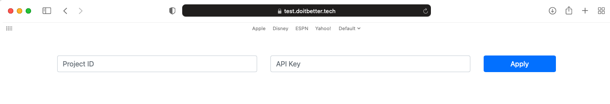
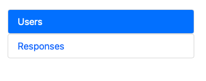
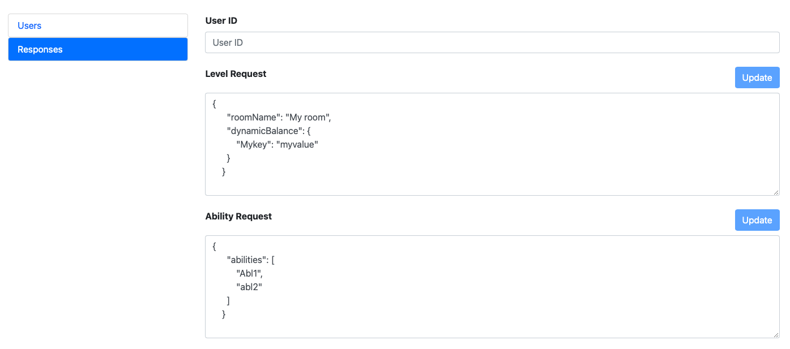

# Game Behaviour Control

After our system has acquired enough data it can suggest certain changes to the game flow as the player
plays the game. Those changes are produced on the fly, i.e. as the player plays the game the game should
as SDK for what to do next.

## Overview

### Latency

Each such request involves network call. Network calls tend to be inconsistent in their latency due to number
of external reasons. To smooth game experience and ease SDK integrations all such calls are guaranteed
to return no later than 5 seconds.

### Empty response handling

In certain situations the SDK won't produce any meaningful suggestion. In that case the result of behaviour
changing calls will be empty. You will need to check if the response is not empty prior to applying it to a game.

**IMPORTANT** Some behaviour changing calls return several pieces of information. For example, `LeveData` has
`roomName` to use as next level **and** `dynamicBalance` to use in the next level. **Both** of these parts
can be empty independently from each other. Here's a pseudo code to handle such situations:

```
var levelData = ... // some code that acquires level data from SDK
if (levelData.roomName is not empty) {
  use levelData.roomName as the next room
}

// at this point even if roomName is empty, the dynamic balance will have the chance to be applied
if (levelData.dynamicBalance) {
  use levelData.dynamicBalance as dynamic balance for the next room
}
```

Each response type has its own ways to check if the result is empty. General rule is to check all possible
bad values, i.e. `null` values, empty strings, empty arrays (or arrays of wrong size), etc.

If the response is empty in some parts the game should behave as if SDK won't there. That means,
if the `roomName` is empty the game should ask its own algorithm which room to use next.

### Response freshness

Behaviour changing calls involve network. You might want to make these calls in advance to avoid
loading times and improve user experience.

In that case it's **important** to keep such call not older than one room. SDK performance depends
heavily on the knowledge of how the player plays **this exact session**.
For example:

* The players starts to play the room number 6 in the first location
* At this point it's reasonable to ask SDK what room to use as room 7, **but** it's strongly
  discouraged to ask for room 8, 9, and so on at this point in time.
* The player finished the room number 6. Started room number 7. The game sent `RoomStarted` event for the
  room number 7.
* At this moment you can ask SDK for the `levelData` for the room number 8.

### Coroutines

Each behaviour control call has two versions: with callback and with coroutine object. Both of these versions
are completely identical. You can choose any version depending on your preferences.

## Game Behaviour Control API

### Level Data

You can ask for level data in one of the following ways:

```c#
game.Level("1_6", levelData => {
  ... // code to process levelData
});

// in a coroutine context
var request = game.LevelRequest("1_6")
yield return request.Run();
if (request.IsDone) {
  ... // code to process levelData
}
```

Once you have `LevelData` object in hand you can process its contents like this:

```c#
var levelData = ...
if (!string.IsNullOrWhiteSpace(levelData.RoomName)) {
  ChangeNextRoom(levelData.RoomName)
}
if (levelData.DynBalance != null) {
  if (levelData.DynBalance["some_dyn_balance_key"].IsString) {
    ApplySomeDynBalanceForTheNextRoom(levelData.DynBalance["some_dyn_balance_key"])
  }
  if (leveData.DynBalance["some_other_key"].IsNumber) {
    ApplySomeOtherDynBalanceForTheNextRoom(leveData.DynBalance["some_other_key"].AsInt)
  }
}
```

### Abilities Data

You can ask for abilities data in one of the following ways:

```c#
game.Abilities("1_6", "level_up", abilitiesData => {
  ... // code to process abilitiesData
});

// in a coroutine context
var request = game.AbilitiesRequest("1_6", "level_up")
yield return request.Run();
if (request.IsDone) {
  ... // code to process abilitiesData
}
```

Once you have `AbilitiesData` object in hand you can process its contents like this:

```c#
var abilitiesData = ...
if ((abilitiesData.abilities != null)
 && (abilitiesData.abilities.Count == 3/* or 2 or other number you expect */) ) {
  ApplyAbilitiesForTheNextRoom(abilitiesData.abilities)
}
```

## API Testing

Overall process for testing behaviour control API is the following:

1. Install the game with SDK to a device (iOS or Android)
1. Obtain a `UserID` for this current installation (Re-install the game if you need to reset `UserID`)
1. Use https://test.doitbetter.tech to set desired response on each API
1. Launch the game and you will receive the response you set

### Testing Panel

During testing you will use https://test.doitbetter.tech. To prepare it to work with your game:

1. Open the website
1. Put `ProjectID` (which is bundle ID for your game) and API key in the top bar
1. Click **"Apply"**



### Obtaining User ID

#### Via Logs

The most straightforward way to obtain a UserID is via logs. Our SDK puts UserID to logs. 
Make sure you have enabled `SetLoggingEnabled(true)`.

#### Via Testing Panel

If for some reason you can't search through logs you can use Testing Panel to obtain UserID.

1. Go to **"Users"** tab in the panel



2. Open the game on the device. **Ensure** that the game was killed, i.e. you are launching the game
not opening it from background.
   
3. Click **"Refresh"** button on the Panel. You will see 10 last users that have logged in. You can
check device model and OS version to find your device from the list.
   
   
## Setting the response

First, open response page on the Testing Panel



Put **UserID** you want to modify response to. Set desired response in the text box than click **"Update"**

## Testing

After you set some response for given user. You will **ALWAYS** receive this response from API. No matter
what `roomNumber` or `reason` you pass to the request.

You can keep the panel website open and change response accordingly to test some rooms one by one.

Once you've done with your testing, you can re-install the game on your device to get a fresh user
which is not affected by testing responses.
